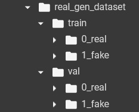

## Guider for training the LNP model  
# Donwload weight for Denoising model  
We download the weight "sidd_rgb.pth" for Denoisnet as https://github.com/swz30/CycleISP/tree/master  
or direct link at  https://drive.google.com/file/d/1sraG9JKmp0ieLjntRL7Jj2FXBrPr-YVp/view  

# Create Dataset  
The dataset directory structure for LNP training we recommend follows the following structure  

